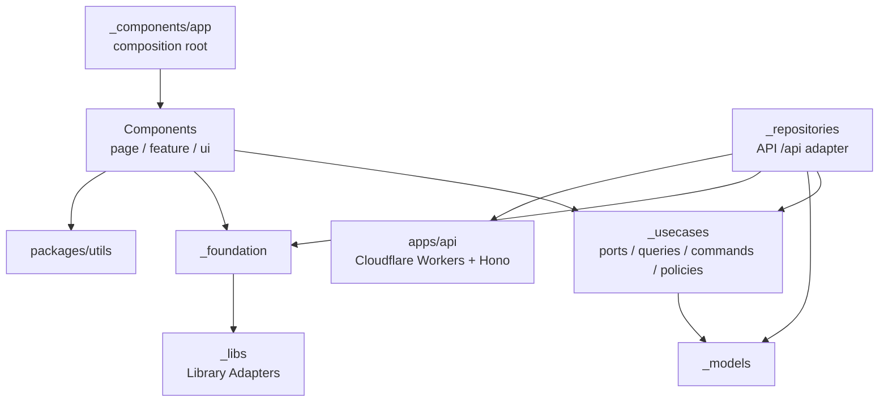

# BooKBooK アーキテクチャガイド

## レイヤーアーキテクチャ

配置判断の軸とフローは [Frontend Directory Structure](./frontend-structure.md) を参照。

## 主要パターン

### Composition Root

具象 repository / gateway の生成は `_components/app` の `repositories.ts` に集約し、`AppProviders` から注入する。usecase / page は port（抽象）にのみ依存する。

### ルーティング

React Router（declarative mode, `react-router`）を使い、URL を画面状態の単一の真実とする。app root（`_components/app/App.tsx`）の `<Routes>` が `/`（Home）・`/library`（Library）・`/history`（CheckoutHistory）・`/settings/*`（Settings、page 内のネスト Routes で `location` / `volume` サブ画面を出し分け）を切り替え、`BottomTabs` は `NavLink` で遷移する。サブ状態は search param に載せる（`/history?tab=past`、`/library?q=`、書き込みは `replace: true` で履歴を汚さない）。未知パスは `/` へリダイレクト。認証ガード（未ログイン時 `LoginScreen`）は Routes の外側で行う。設定の「戻る」は `navigate(-1)` + 直リンク時 fallback（`page/Settings/_internal/useBackWithFallback.ts`）。

### エラーハンドリング

Result 型 + 早期リターンでエラーを表現する（現状は `apps/web/src/_foundation/result.ts`。外部依存がないため `packages/utils` への移設が目標）。

### データ取得

サーバーデータのキャッシュ・再検証は SWR に統一する（`main.tsx` の `SWRConfig`）。独自 store は作らない。
