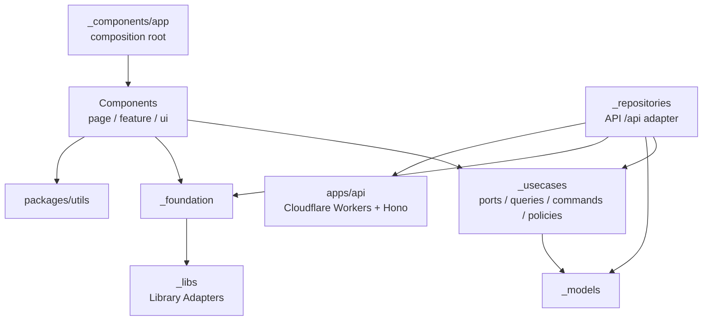

# BooKBooK アーキテクチャガイド

## レイヤーアーキテクチャ

配置判断の軸とフローは [Frontend Directory Structure](./frontend-structure.md) を参照。

## 主要パターン

### Composition Root

環境の解決は `_components/app/config.ts` の純関数 `resolveAppConfig`（`VITE_APP_PROFILE` による名前付きプロファイル `production` / `mock`。不明値は throw、未設定は dev のみ mock にフォールバックし本番ビルドでは throw）、具象 repository / gateway の生成は `repositories.ts` の `createRepositories(config)` に集約する。プロファイルは常に整合した完全な構成を生成し、repo 単位の部分差し替えはしない（book / history は参照整合性で結合しているため）。組み立ては `main.tsx` で1回だけ行い、`<App config repositories>` の props → `AppProviders` → Context で注入する。usecase / page は port（抽象）にのみ依存する。`Repositories` のキーは具象クラスではなく port（能力）単位とし、1つの具象が複数 port を実装する場合も同一インスタンスを port 別のキーで公開して root に閉じる。Http repository は fetch を直接呼ばず `_foundation/http/client.ts` の `HttpClient` を注入され、横断関心事（認証・リトライ等）は client のデコレータとして root で合成する。

### ルーティング

React Router（declarative mode, `react-router`）を使い、URL を画面状態の単一の真実とする。app root（`_components/app/App.tsx`）の `<Routes>` が `/`（Home）・`/library`（Library）・`/history`（CheckoutHistory）・`/settings/*`（Settings、page 内のネスト Routes で `location` / `volume` サブ画面を出し分け）を切り替え、`BottomTabs` は `NavLink` で遷移する。サブ状態は search param に載せる（`/history?tab=past`、`/library?q=`、書き込みは `replace: true` で履歴を汚さない）。未知パスは `/` へリダイレクト。認証ガード（未ログイン時 `LoginScreen`）は Routes の外側で行う。設定の「戻る」は `navigate(-1)` + 直リンク時 fallback（`page/Settings/_internal/useBackWithFallback.ts`）。

### エラーハンドリング

Result 型 + 早期リターンでエラーを表現する（`packages/utils` の `result.ts`。`UseCaseResult` を usecase 層で使う）。

### データ取得

サーバーデータのキャッシュ・再検証は SWR に統一する（`main.tsx` の `SWRConfig`）。独自 store は作らない。
